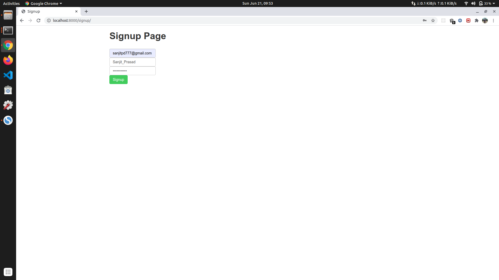
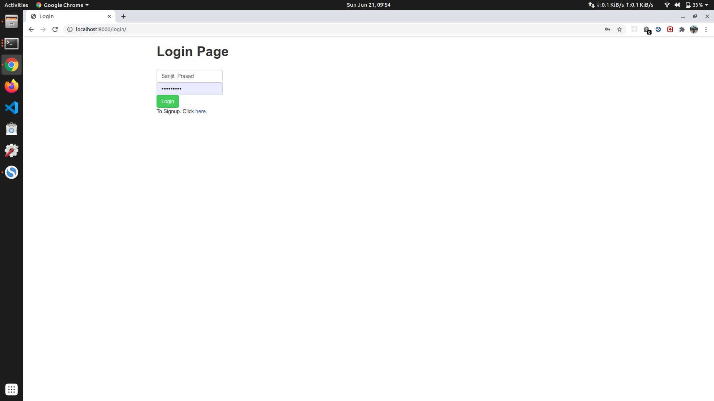
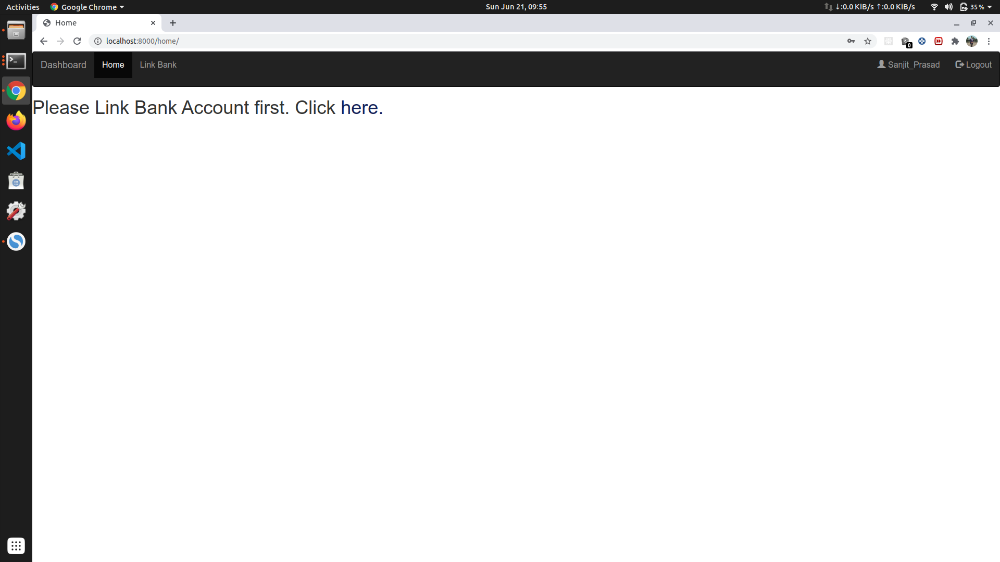
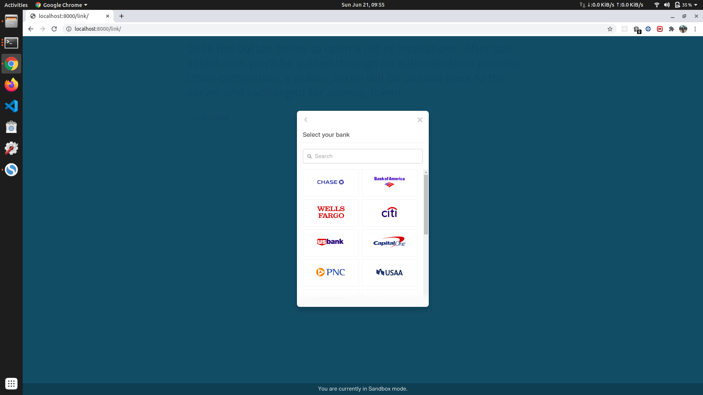
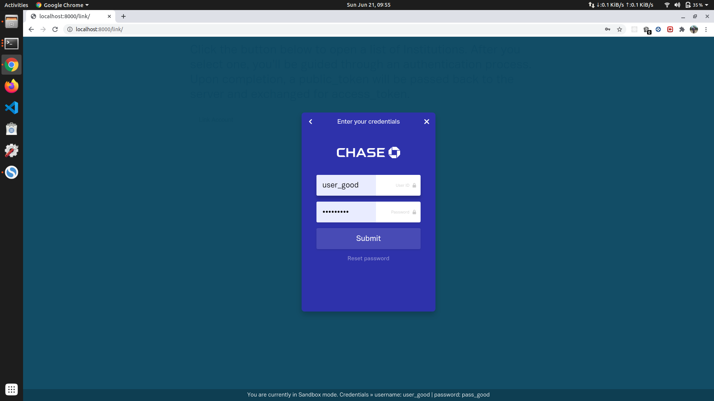
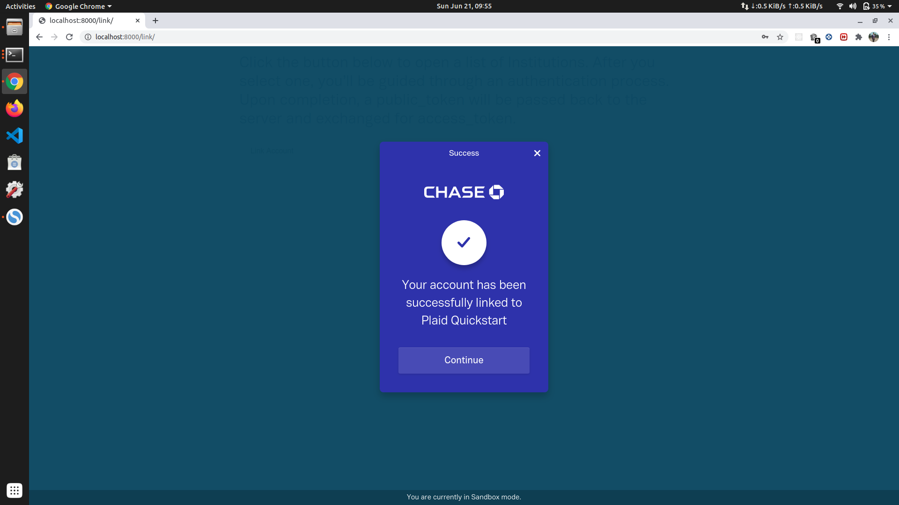
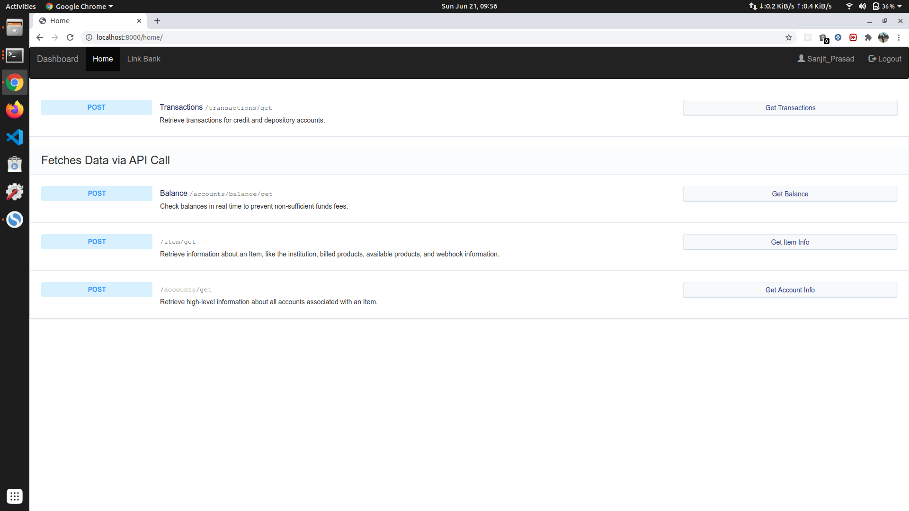
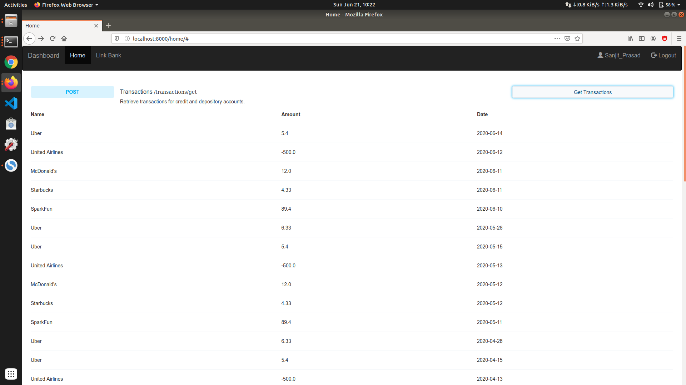
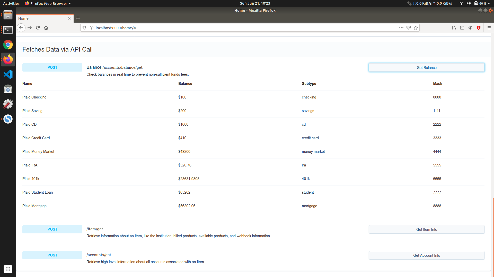
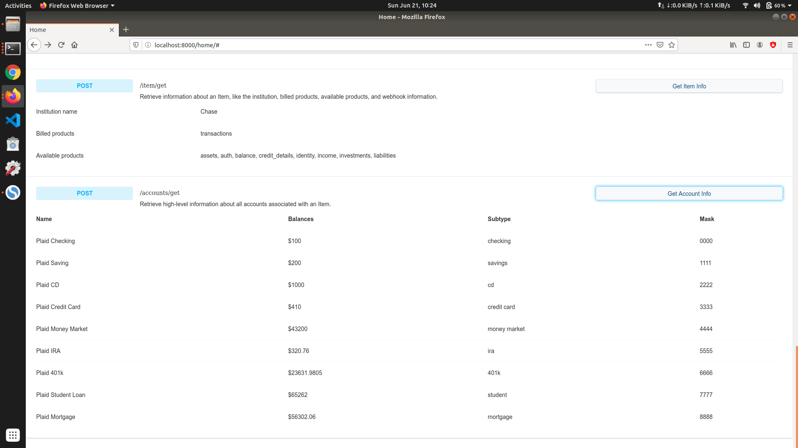

# Images for better Visualization of project

**Signup Page**

**Login Page**

**HomePage**

**Select Bank**

**Verify Bank Details**

**Bank Added Successfully**

**HomePage When Bank Added**

**Last 2 Years Transaction**

**Account Balance Info**

**Other Infos**

# Setting Up the project with Plaid and Django Rest Framework

# Django Assignment

[Plaid](https://plaid.com/docs/)​ is an account aggregation service where users can login with their bank credentials and plaid fetches last two years of transaction and account balance data for their bank account. This project is its implementation using Django.

* `Item`​ , a set of credentials (map of key value pairs) associated with a financial institution and a user.
  * Users can have multiple Items for multiple financial institutions.

* Each `​Item​` can have many associated accounts, which hold information such as balance, name, and account type

    

* **Credit and depository**​ accounts can have `Transactions` associated with them

# Setting Up

Clone the project on your system:

    $ git clone https://github.com/Sanjit-Prasad/DjangoAssignment.git
    $ cd DjangoAssignment

## Setting Database

You need to set up the database for the project. We are using CloudSQL here for production but you are free to use any DataBase of your choice.

These are the steps for setting up CloudSQL. You may skip it if you want to use local DataBase instead. Before you can connect a mysql to a Cloud SQL instance, you must have:

* Created a Cloud SQL instance, including configuring the default user.

  * For more information about creating instances, see [Creating Instances](https://cloud.google.com/sql/docs/mysql/create-instance).

  * For more information about configuring the default user, see [Configuring the default user account](https://cloud.google.com/sql/docs/mysql/create-manage-users#user-root).

* Determined how you will connect to your instance.

  * For information about the available connection options and how to choose between them, see [Connection Options for External Applications](https://cloud.google.com/sql/docs/mysql/external-connection-methods).
    
* Installed the [mysql client](https://dev.mysql.com/downloads/mysql/).

* [Enable](https://console.cloud.google.com/flows/enableapi?apiid=sqladmin) the Cloud SQL Admin API.

Finally install the proxy and run:

    $ wget https://dl.google.com/cloudsql/cloud_sql_proxy.linux.amd64 -O cloud_sql_proxy
    $ chmod +x cloud_sql_proxy
    $ ./cloud_sql_proxy -instances=<INSTANCE_CONNECTION_NAME>=tcp:3306

In case there is some issue, you can find a detailed set up guide [here](https://cloud.google.com/sql/docs/mysql/connect-admin-proxy).

If you want to use DataBase from your system only. You are free to choose sqlite (by default), [mysql](https://dev.mysql.com/downloads/mysql/) or any other database. You will need to change the `settings.py` accordingly.

For sqlite:

    DATABASES = {
        'default': {
            'ENGINE': 'django.db.backends.sqlite3',
            'NAME': os.path.join(BASE_DIR, 'db.sqlite3'),
        }
    }

For mysql:

    DATABASES = {
        'default': {
            'ENGINE': 'django.db.backends.mysql',
            'HOST': '127.0.0.1',
            'PORT': '3306',
            'NAME': $DATABASE_NAME,
            'USER': $DATABASE_USER,
            'PASSWORD': $DATABASE_PASSWORD,
        }
    }

For more info you can refer [this](https://docs.djangoproject.com/en/3.0/ref/settings/#databases).

## Setting Up Redis

We are using [Redis](https://redis.io/) as our message broker for celery. Download [redis](https://redis.io/download) and extract the tar.gz file.

Open the folder and then in terminal run:

    $ make
    $ sudo make install

After that you can run the redis server:

    $ redis-server

## Setting Up Virtual Environment

First of all you need the python3 installed in your system. Also you will need to install python3-pip:

    $ sudo apt update
    $ sudo apt install python3 python3-pip

After this you can create the virtual environment using `venv`:

    $ python3 -m venv /path/to/new/virtual/environment

Let the new virtual environment be `env`. You need to add your secret keys to the environment variables in `env/bin/activate` file. You can get the list of keys which you need to store, in the `plaid_link/keys.py`. To add the variables open the file `env/bin/activate` and add environment variables:

    export PLAID_SECRET='your_secret_key'
    export PLAID_PUBLIC_KEY='your_public_key'

After adding all the values just activate the environment:

    $ source env/bin/activate

Now, install the dependencies from `requirements.txt`:

    $ pip install -r requirements.txt

## Setting Up Celery

[Celery](https://docs.celeryproject.org/en/stable/) is used to perform tasks asynchronously. Use pip to install necessary dependency if not already done::

    $ pip install -r requirements.txt

Migrate the changes for celery results:

    $ python manage.py migrate django_celery_results

Now start the worker process:

    $ celery -A plaid_django worker -l info

Now celery worker is running in background. You can call the tasks asynchronously. You can test this by running test_celery() in django shell::

    $ python manage.py shell:

    >>> from plaid_link.tests import test_celery
    >>> test_celery()

## Setting up ngrok

[ngrok](ngrok.io) is used to capture the response from the webhooks. Webhooks can send response to public domains only. ngrok connects a public domain to our `localhost` via tunnel. To install ngrok, go to [ngrok.io](ngrok.io) and follow their installation steps. After that:

    $ ./ngrok http -host-header=localhost 8000

This should start up a secure tunnel that is connected to your local HTTP port. It will output like this:

    Session Status                online
    Version                       2.1.18
    Region                        United States (us)
    Web Interface                 http://127.0.0.1:4041
    Forwarding                    http://dda5f8fd.ngrok.io -> localhost:8000
    Forwarding                    https://dda5f8fd.ngrok.io -> localhost:8000

The forwarding URL http://dda5f8fd.ngrok.io is what you need to use for the webhook. Your URL will be different, so use whatever ngrok provides.

For more details please refer [Handling webhooks using Django and ngrok](https://hackernoon.com/handling-webhooks-using-django-and-ngrok-b7ff27a6fd47) and [Plaid Python Documentation](https://plaid.github.io/plaid-python/index.html?highlight=webhook#plaid.api.sandbox.Sandbox.Item.Item.fire_webhook).

## Run Server
After setting up all the things you need to migrate the changes, create admin user and run the server:

    $ python manage.py makemigrations
    $ python manage.py migrate
    $ python manage.py createsuperuser
    $ python manage.py collectstatic
    $ python manage.py runserver

## Sum Up

Above were the steps for setting up first time. In case you already had set up the project you can start the server in few steps:

    $ ./cloud_sql_proxy -instances=<INSTANCE_CONNECTION_NAME>=tcp:3306
    $ ./ngrok http -host-header=localhost 8000
    $ redis-server
    $ source ./env/bin/activate
    $ celery -A plaid_django worker -l info
    $ python manage.py runserver
